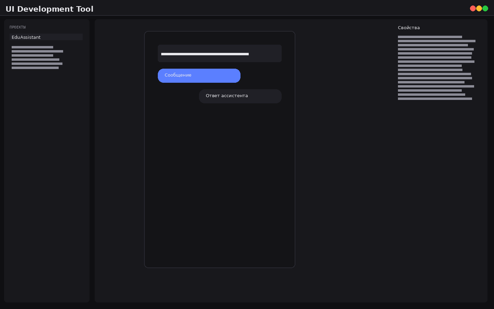
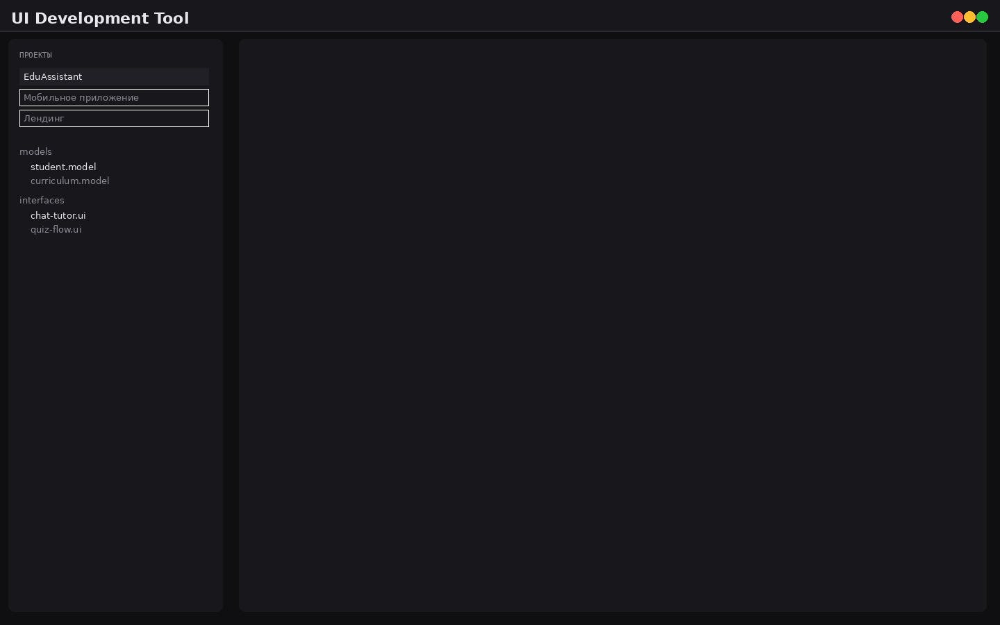
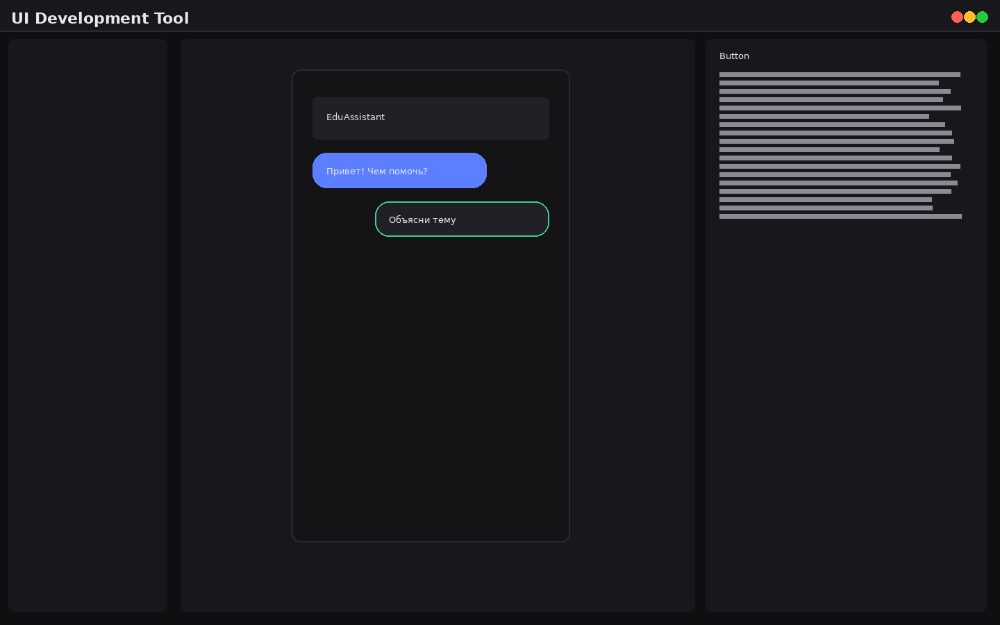
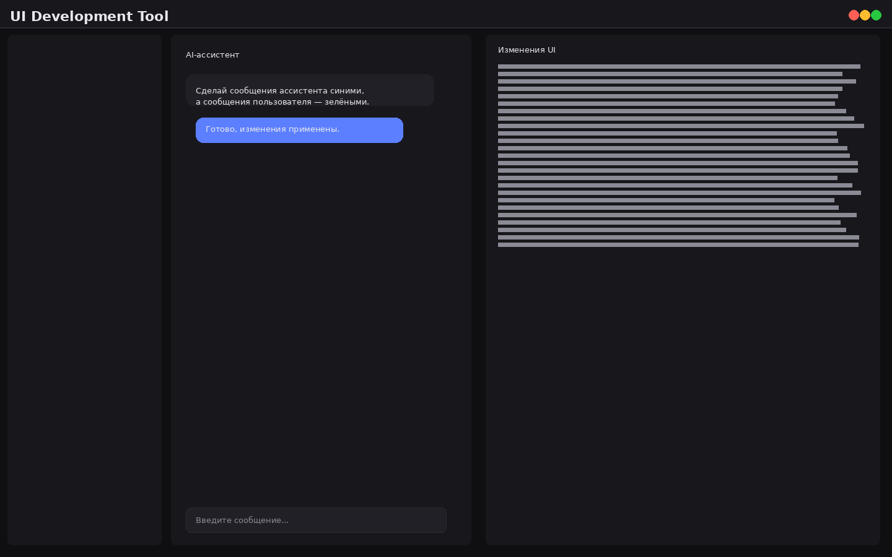
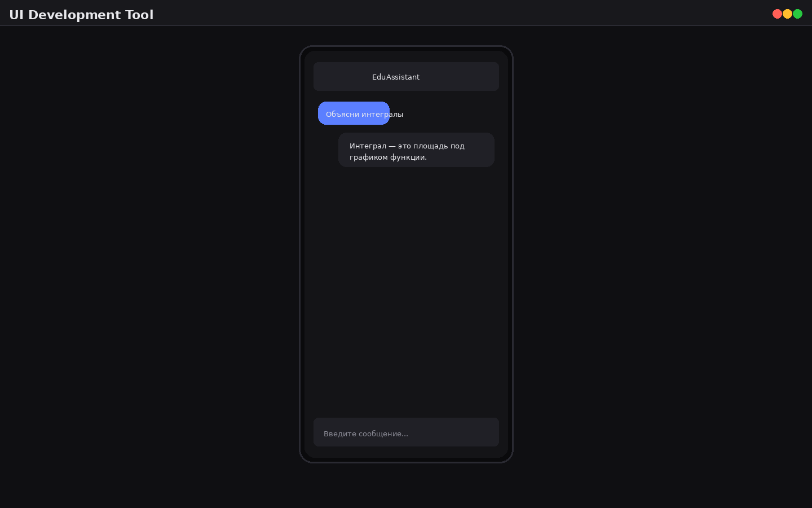
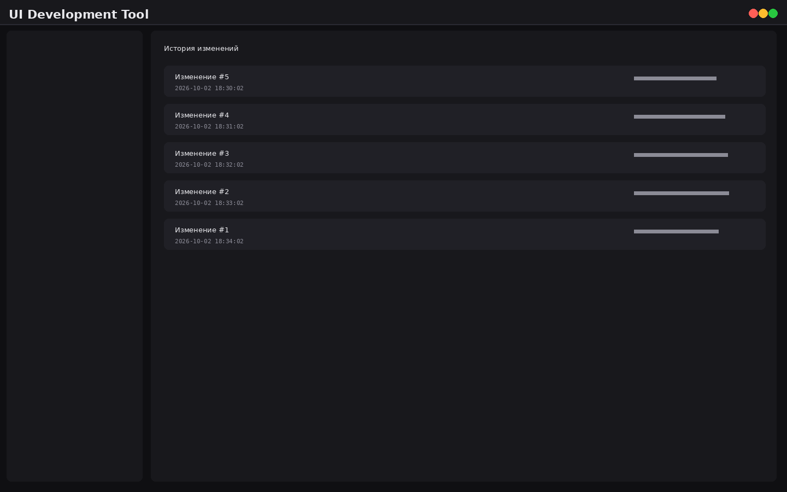
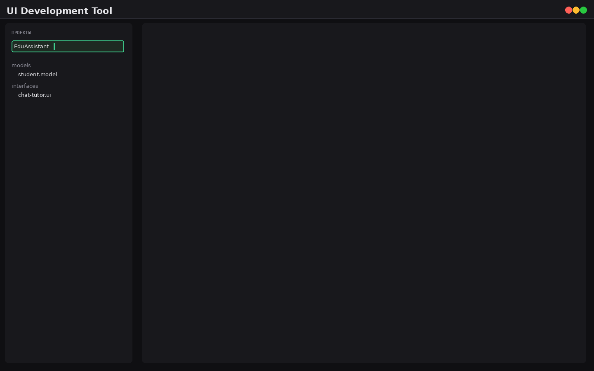
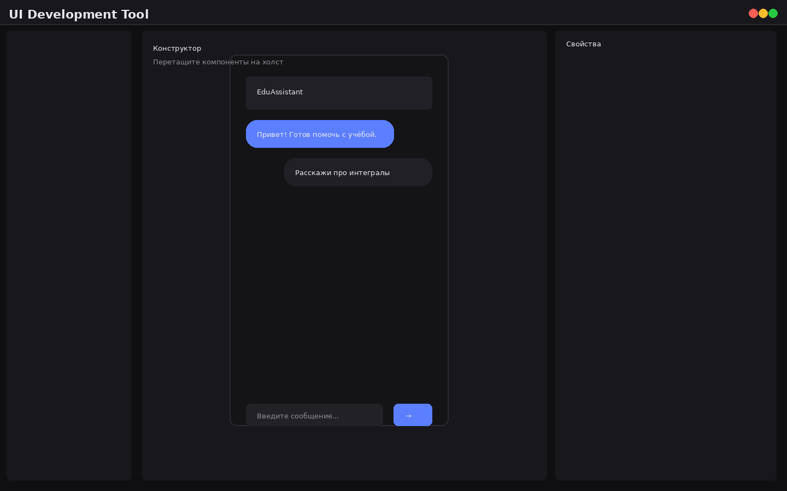
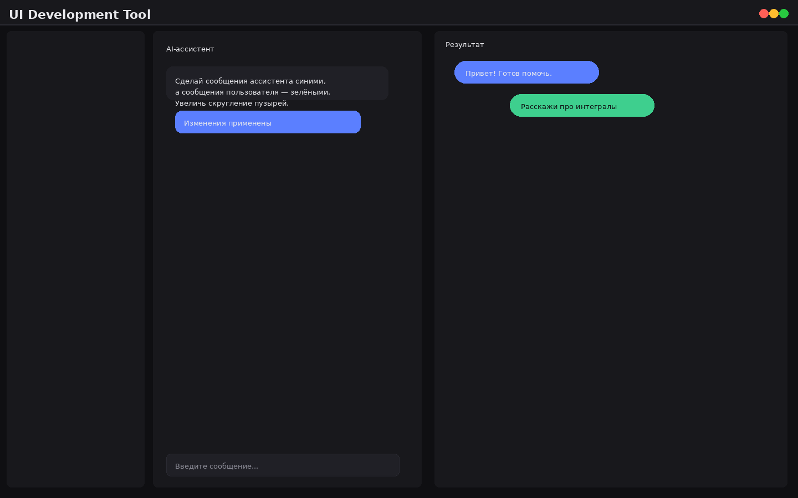
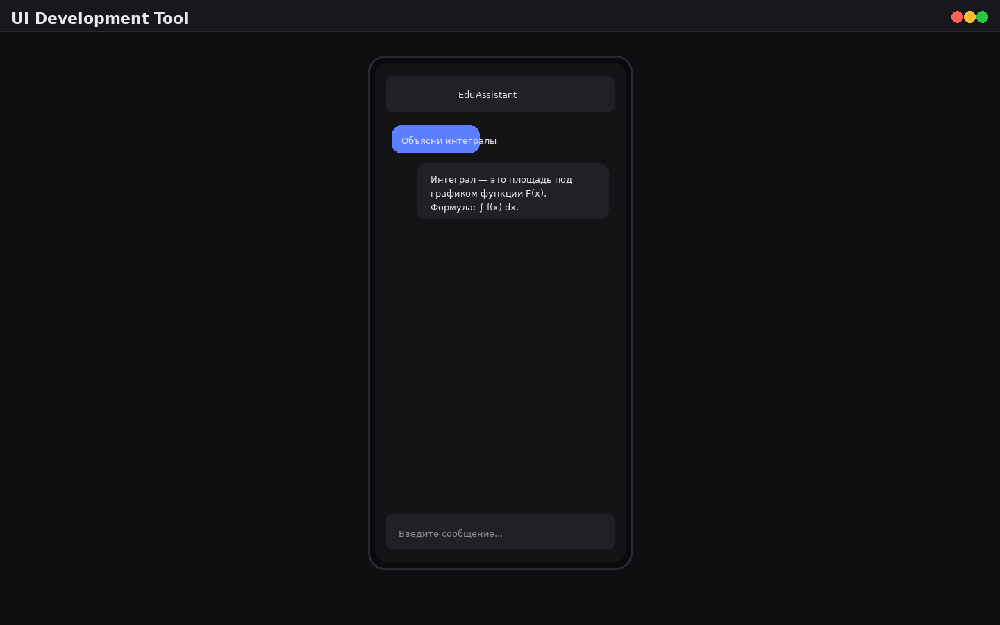

# UI Development Tool

Инструмент для визуальной разработки мобильных интерфейсов с помощью AI-ассистента. Создавайте проекты, проектируйте UI, общайтесь с ассистентом на естественном языке и мгновенно получайте готовый результат.

## Возможности

- **Проекты** — создавайте, переименовывайте и удаляйте проекты через боковую панель.
- **Визуальный конструктор** — перетаскивайте компоненты, редактируйте свойства, настраивайте цвета, размеры и расположение.
- **AI-ассистент** — описывайте желаемые изменения текстом, и ассистент обновит интерфейс.
- **Превью** — запускайте интерактивный превью проекта и тестируйте диалог с ассистентом в реальном времени.
- **История изменений** — отслеживайте все правки UI в панели изменений.

---

## Технологии

### Клиент

- React 19
- Vite 8
- Tailwind CSS v4
- TypeScript

### Сервер

- FastAPI
- PostgreSQL
- psycopg2
- uv

---

## Структура проекта

```
ui-development-tool/
├── client/                 # React + Vite приложение
│   ├── src/
│   │   ├── main.tsx        # Точка входа React
│   │   ├── App.tsx         # Корневой компонент
│   │   ├── api.ts          # HTTP-клиент для всех API
│   │   ├── theme.ts        # Дизайн-токены
│   │   └── types.ts        # Общие TypeScript-типы
│   ├── workplace-ui/       # Рабочее пространство (шапка, настройки, layout)
│   ├── projects-browser/   # Браузер проектов и файлов
│   ├── ui-kit/             # Визуальный UI-конструктор
│   ├── ui-viewer/          # Панель превью
│   ├── llm-communicator/   # Панель диалога с AI
│   └── changes-panel/      # Панель истории изменений
│
└── server/                 # FastAPI бэкенд
    ├── src/server/
    │   ├── main.py         # Точка входа FastAPI, все роуты
    │   ├── config.py       # Переменные окружения
    │   ├── schemas.py      # Pydantic-схемы запросов/ответов
    │   ├── ai/             # Клиент LLM и UI-ассистент
    │   ├── preview/        # Генерация HTML-превью
    │   └── projects_manager/  # Репозитории для работы с БД
    ├── pyproject.toml
    └── README.md
```

### Связь клиента и сервера

| Компонент клиента | Используемый endpoint сервера | Назначение |
|-------------------|-------------------------------|------------|
| `src/api.ts` | все `/api/*` | Единый HTTP-клиент: проекты, файлы, UI-state, изменения |
| `projects-browser` | `GET /api/projects`, `POST /api/projects`, `PATCH /api/projects/{id}`, `DELETE /api/projects/{id}` | Управление списком проектов |
| `projects-browser` | `GET /api/projects/{id}/files`, `POST /api/projects/{id}/files`, `PATCH /api/files/{id}`, `DELETE /api/files/{id}` | Дерево файлов проекта |
| `ui-kit` | `GET /api/projects/{id}/ui-state`, `PATCH /api/projects/{id}/ui-state` | Загрузка и сохранение состояния UI |
| `ui-kit` + `changes-panel` | `GET /api/projects/{id}/ui-changes`, `POST /api/projects/{id}/ui-changes` | История изменений интерфейса |
| `llm-communicator` | `POST /api/chat` | Потоковый диалог с AI-ассистентом |
| `llm-communicator` | `POST /api/ui/apply` | Применение изменений UI по текстовому запросу |
| `ui-viewer` / preview | `GET /preview/{id}` | HTML-страница интерактивного превью |
| `ui-viewer` / preview | `POST /api/preview/{id}/chat` | Диалог внутри превью с сохранением изменений |

---

## Установка и запуск

### 1. Клонирование репозитория

```bash
git clone <URL репозитория>
cd ui-development-tool
```

### 2. Запуск сервера

```bash
cd server
uv run server
```

Сервер поднимется на `http://localhost:8000`.

#### Альтернативный запуск через uvicorn

```bash
cd server
uv run uvicorn server.main:app --reload
```

### 3. Запуск клиента

В новом терминале:

```bash
cd client
pnpm install
pnpm dev
```

Клиент откроется на порту `8443` (или на том, что указан в переменной `PORT`).


## Переменные окружения

Создайте файл `server/.env`:

```env
DB_HOST=localhost
DB_PORT=5432
DB_NAME=ui_projects_db
DB_USER=postgres
DB_PASSWORD=password

AI_BASE_URL=https://opencode.ai/zen/go/v1
AI_MODEL=kimi-k2.7-code
AI_API_KEY=your_api_key_here
```

| Переменная | Описание | По умолчанию |
|------------|----------|--------------|
| `DB_HOST` | Хост PostgreSQL | `localhost` |
| `DB_PORT` | Порт PostgreSQL | `5432` |
| `DB_NAME` | Имя базы данных | `ui_projects_db` |
| `DB_USER` | Пользователь БД | `postgres` |
| `DB_PASSWORD` | Пароль пользователя БД | `password` |
| `AI_BASE_URL` | Базовый URL API LLM | `https://opencode.ai/zen/go/v1` |
| `AI_MODEL` | Модель LLM | `kimi-k2.7-code` |
| `AI_API_KEY` | API-ключ для LLM | — |

---

## API

Основные endpoint'ы:

| Метод | Путь | Описание |
|-------|------|----------|
| GET | `/api/projects` | Список проектов |
| POST | `/api/projects` | Создать проект |
| GET | `/api/projects/{id}` | Получить проект с файлами |
| PATCH | `/api/projects/{id}` | Переименовать проект |
| DELETE | `/api/projects/{id}` | Удалить проект |
| GET | `/api/projects/{id}/files` | Файлы проекта |
| POST | `/api/projects/{id}/files` | Создать файл/папку |
| GET | `/api/projects/{id}/ui-state` | Текущее состояние UI |
| PATCH | `/api/projects/{id}/ui-state` | Обновить UI |
| GET | `/api/projects/{id}/ui-changes` | История изменений UI |
| POST | `/api/chat` | Диалог с AI-ассистентом |
| POST | `/api/ui/apply` | Применить изменения UI через AI |
| GET | `/preview/{id}` | HTML-превью проекта |

Полная документация доступна по адресу `http://localhost:8000/docs` после запуска сервера.

---


## Скриншоты

### Главный экран / рабочее пространство

Общий вид приложения с открытым проектом, деревом файлов и панелью инструментов.



### Панель проектов

Боковая панель со списком проектов и древовидной структурой файлов.



### Визуальный конструктор

Холст с размещёнными компонентами и панелью свойств для редактирования.



### Диалог с AI-ассистентом

Панель общения с ассистентом: запросы на естественном языке и ответы.



### Превью проекта

Интерактивный превью с диалогом, имитирующий работу готового приложения.



### История изменений

Панель с историей правок UI, где можно отследить все внесённые изменения.



---

## Пример создания образовательного ассистента в среде

Ниже показан типовой сценарий: создаём образовательного ассистента «EduAssistant», который помогает ученику с учебной программой.

### 1. Создание проекта

При первом запуске сервер автоматически создаёт проект `Проект' с основной структурой:

```
EduAssistant/
├── models/
│   ├── student.model
│   ├── curriculum.model
│   └── session.model
├── interfaces/
│   ├── chat-tutor.ui
│   └── quiz-flow.ui
└── tests/
    └── tutor-eval.test
```

Если проект не создан автоматически, создайте его в панели проектов через кнопку «Новый проект».



### 2. Проектирование интерфейса чат-тьютора

Откройте файл `interfaces/chat-tutor.ui` и в визуальном конструкторе соберите макет:

1. Добавьте `Container` на весь экран — тёмный фон чата.
2. Разместите `Text` вверху — заголовок «Ассистент».
3. Добавьте несколько `Bubble` — сообщения ассистента.
4. Добавьте `Button` — сообщения пользователя.
5. Внизу расположите `TextField` для ввода вопроса и `Button` «Отправить».



### 3. Изменение интерфейса через AI

В панели `llm-communicator` отправьте запрос:

> «Сделай сообщения ассистента синими, а сообщения пользователя — зелёными. Увеличь скругление пузырей.»

AI-ассистент вернёт обновлённое состояние интерфейса, которое автоматически применится на холсте.



### 4. Сохранение и история

Каждое изменение можно сохранить через `PATCH /api/projects/{id}/ui-state`. История всех правок доступна в панели `changes-panel` через `GET /api/projects/{id}/ui-changes`.

### 5. Превью и тестирование

Откройте страницу превью:

```
http://localhost:8000/preview/{project_id}
```

В превью можно пообщаться с ассистентом. Если во время диалога вы попросите изменить интерфейс («сделай кнопки круглыми»), ассистент обновит UI проекта, и после перезагрузки превью вы увидите результат.



### 6. Дальнейшее развитие

- Добавьте в папку `models/` модель учебной программы `curriculum.model`.
- Создайте второй экран `quiz-flow.ui` с компонентами `Card`, `Text`, `Button` и `Select` для викторин.
- В папке `tests/` опишите сценарии оценки качества ответов тьютора.

---

## Пример создания проекта через API

После запуска сервера проект можно создать одним HTTP-запросом:

```bash
curl -X POST http://localhost:8000/api/projects \
  -H "Content-Type: application/json" \
  -d '{"name": "EduAssistant"}'
```

Ответ:

```json
{
  "id": 1,
  "name": "EduAssistant",
  "created_at": "2026-10-02T18:00:00",
  "updated_at": "2026-10-02T18:00:00"
}
```

После создания проекта сервер автоматически добавляет стартовую структуру файлов:

```
EduAssistant/
├── models/
│   ├── student.model
│   ├── curriculum.model
│   └── session.model
├── interfaces/
│   ├── chat-tutor.ui
│   └── quiz-flow.ui
└── tests/
    └── tutor-eval.test
```

---

## Лицензия

[LICENSE](LICENSE)
